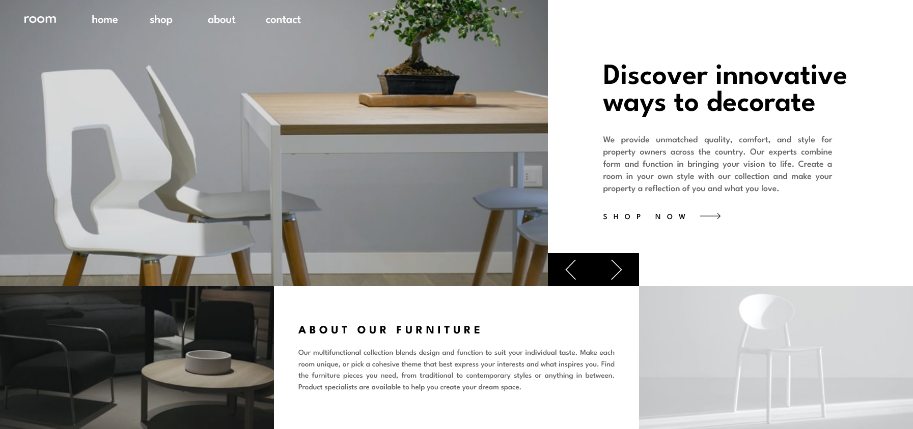

# Frontend Mentor - Room homepage solution

This is a solution to the [Room homepage challenge on Frontend Mentor](https://www.frontendmentor.io/challenges/room-homepage-BtdBY_ENq). Frontend Mentor challenges help you improve your coding skills by building realistic projects. 

## Overview

This is the solution to a design for a homepage about furniture. It has different hero images, which the user can click through and adjusts well to different screen sizes. 

### Links

[Solution](https://your-solution-url.com)
[Live Site](https://your-live-site-url.com)

## My process

### Built with

- React
- CSS grid 
- css background image

### What I learned

This challenge was very useful to get more acquainted with CSS grid. I had also never coded a carousel for the hero section before, which was easier than expected. I think the page adjusts very nicely to different viewports and I'm proud that I managed to do it in an easy way where all of the proportions stay intact. 

### Continued development

I think the design could use some more work in terms of contrast, maybe choosing a slightly different background color. 

## Author

- Frontend Mentor - [@lux4198](https://www.frontendmentor.io/profile/lux4198)
- Twitter - [@luxumos24](https://www.twitter.com/luxmos24)
